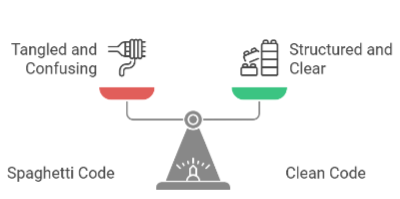

# Software richtig entwickeln: Es ist mehr als nur Programmieren
**[English Version](https://github.com/AlexNek/software-dev-resources/blob/master/SDLC/readme.md)**

## Überblick

Also, Sie versuchen, die Softwareentwicklung heutzutage zu **verstehen**, richtig? Es geht nicht mehr nur um das Schreiben von Code, sondern Dinge zu schaffen, die gut funktionieren, von Leuten wirklich benutzt *werden* und die nicht kaputtgehen, wenn es schwierig wird. Die Zeit, als Programmieren eine Einzelarbeit war, ist vorbei. Also, wie schaffen wir das eigentlich? Lass es uns erkunden.

Dieser Artikel behandelt die wichtigsten Aspekte der aktuellen Softwareentwicklung und zeigt, warum der Softwareentwicklungslebenszyklus (Software Development Life Cycle - SDLC) wichtig ist. Wir werden diskutieren, warum es wichtig ist, das Problem, das Sie lösen, zu **identifizieren**, eine agile Arbeitsweise anzunehmen, warum sauberer Code wichtig ist und die Bedeutung von DevOps. Schließlich werden wir alles miteinander verbinden, indem wir uns auf den Benutzer konzentrieren, dass Softwareentwicklung ein kontinuierlicher Prozess ist und wie man alles abschließt.

Wenn Sie ein **erfahrener Entwickler** sind, wissen Sie das meiste davon wahrscheinlich schon. Dieser Artikel richtet sich in erster Linie an Projektmanager, die **Schwierigkeiten** mit der Softwareentwicklung  spüren, aber nicht genau wissen, wo sie anfangen sollen.

## Checkliste für Manager

Verwenden Sie diese Checkliste, um Ihren Softwareentwicklungsprozess zu bewerten. Wenn Sie die meisten Fragen mit "Nein" beantworten, sollten Sie Ihre Prozesse verbessern:

-   **Das Problem verstehen:**
    -   Nehmen wir uns genügend Zeit, um die wirklichen Bedürfnisse unserer Benutzer zu verstehen, oder konzentrieren wir uns nur auf die Anfragen?
    -   Beziehen wir Benutzer in den frühen Phasen des Prozesses ein?
-   **Planung und Iteration:**
    -   Planen wir die Arbeit in kleinen Zyklen oder versuchen wir, alles auf einmal zu planen?
    -   Sind wir bereit, bei Bedarf den Kurs zu ändern?
-   **Code schreiben:**
     - Stellen wir sicher, dass unser Code sauber, gut dokumentiert und leicht verständlich ist?
     - Führen wir regelmäßig Code-Reviews durch?
     - Nutzen wir die Versionskontrolle korrekt und konsequent?
-   **Testen:**
    -   Testen wir frühzeitig und häufig, um Fehler rechtzeitig zu erkennen und zu beheben?
    -   Verwenden wir verschiedene Arten von Tests (Unit-, Integrations-, Benutzerakzeptanztests)?
-   **Zusammenarbeit:**
    -   Arbeiten Entwickler, Produktverantwortliche, Designer und Benutzer eng zusammen, um gemeinsame Ziele effizient zu erreichen?
    -   Haben wir eine klare Kommunikation und regelmäßige Meetings?
-   **Bereitstellung und Überwachung:**
    -   Automatisieren wir den Bereitstellungsprozess, um Fehler zu minimieren?
    -   Überwachen wir die Software und die Server nach der Bereitstellung?
-   **Lernen und Verbesserung:**
    -   Reflektieren wir regelmäßig darüber, was gut gelaufen ist und was wir besser machen könnten?
    -   Investieren wir kontinuierlich in unser Wissen und unsere Kompetenzen?

Eine überwiegende Anzahl an 'Nein'-Antworten zeigt, dass Handlungsbedarf besteht. Schauen wir uns an, wie Sie Ihre Prozesse verbessern können

## Mit dem "Warum" beginnen

Bevor wir irgendeinen Code schreiben, müssen wir wissen, *warum* wir das tun. "Weil der Chef es gesagt hat," ist kein guter Grund. Man muss etwas tiefer graben. Wir fangen mit der Arbeit an, weil **wir wissen, dass die Leute dieses Produkt brauchen**. Das bedeutet, mit Benutzern zu reden und herauszufinden, welches Problem wir genau lösen. Wenn unser Produkt niemandem wirklich hilft, wird es nicht nützlich sein.

*   **Benutzerinterviews:** Um das Problem zu verstehen, sprechen Sie mit echten Benutzern. Sehen Sie, wie sie Dinge tun, verstehen Sie ihre Probleme und stellen Sie detaillierte Fragen. Hören Sie zu, was sie sagen, und konzentrieren Sie sich auf ihre tatsächlichen Bedürfnisse.
*   **Sprechen Sie mit den Beteiligten:** Besprechen Sie Projektziele und Grenzen mit den Beteiligten und untersuchen Sie die Projektziele und die gewünschten Ergebnisse.
*   **User Stories:** Verwenden Sie kurze Beschreibungen, sogenannte "User Stories", um zu beschreiben, was ein Benutzer möchte. Verwenden Sie Prototypen, um Ideen zu testen und Feedback zu sammeln, und stellen Sie sicher, dass sie schnell und interaktiv sind, um wertvolle Informationen zu erhalten.
*   **Datenanalyse:** Verwenden Sie Daten aus früheren Projekten, Marktforschung oder Umfragen, um Muster zu erkennen und das Benutzerverhalten zu verstehen. Verwenden Sie diese Daten, um Ihre anfänglichen Annahmen darüber zu bestätigen, was die Benutzer benötigen.
*   **Prototypen verwenden:** Erstellen Sie schnell Prototypen, um Ideen frühzeitig zu testen, und um Feedback von den Benutzern zu bekommen.
*   **Domain-Driven Design (DDD):** Wenn Sie komplexe Projekte haben, verwenden Sie DDD, um die Software um Geschäftskonzepte herum zu entwickeln und eine gemeinsame Sprache für Entwickler und Experten zu schaffen.

## Agil: Flexibilität als Schlüssel zur Anpassung

Früher nahm man an, dass man den gesamten Plan kennen müsse, bevor man überhaupt anfängt. Viel Zeit wurde in die Planung investiert, noch bevor der erste Code geschrieben war, in der Hoffnung, dass sich die Anforderungen nicht ändern würden. Wie wir alle wissen, führt das häufig zu Frustration und Missverständnissen. Die moderne Softwareentwicklung hingegen setzt darauf, Veränderungen nicht nur zu akzeptieren, sondern aktiv darauf zu reagieren und flexibel zu bleiben. Agil zu arbeiten bedeutet nicht, ständig alles neu zu erfinden, sondern vielmehr die Fähigkeit zu besitzen, auf das Unvorhersehbare einzugehen und in kurzen, intensiven Zyklen kontinuierlich greifbare Ergebnisse zu liefern.

Agilität ist keine völlig neue Idee, sondern eine Denkweise, die sich auf Anpassungsfähigkeit und kontinuierliches Feedback stützt. Anstatt davon auszugehen, dass alle Anforderungen zu Beginn vollständig und richtig sind, akzeptieren wir, dass sich diese jederzeit ändern können, und arbeiten in kurzen Iterationen, die uns erlauben, schnell zu lernen und uns kontinuierlich zu verbessern.

Agile Methoden ermöglichen es uns, in überschaubaren Zeiträumen zu planen, Anpassungen vorzunehmen und die Richtung zu ändern, wenn es nötig ist. Statt starr am ursprünglichen Plan oder Design festzuhalten, geht es darum, in kleinen, überschaubaren Schritten immer wieder einen Mehrwert zu liefern. Hier sind einige agile Praktiken, die uns auf diesem Weg begleiten:

- **Tägliche Stand-ups:** Diese kurzen Meetings bieten die Gelegenheit, den aktuellen Fortschritt zu teilen, auftretende Probleme zu besprechen und zu sehen, ob es Themen gibt, die besondere Aufmerksamkeit erfordern.
- **Sprintplanung:** In dieser Phase setzen wir die Prioritäten und planen, was im nächsten Sprint zu tun ist, damit alle Teammitglieder wissen, was sie erwartet.
- **Sprint Reviews:** Den Projektbeteiligten zu zeigen, was wir erreicht haben und wertvolles Feedback zu erhalten, um in den nächsten Zyklen noch besser zu werden.
- **Sprint Retrospektiven:** Nach jedem Sprint reflektieren wir, was gut gelaufen ist und was wir im nächsten Sprint noch optimieren können, um effizienter und zielgerichteter zusammenzuarbeiten.

## Codequalität: Sauber und Testbar halten

Lass uns nun über den Code sprechen. Wir alle haben irgendwann einmal **schlechten** Code geschrieben. Das passiert. Aber lasst uns das absichtlich vermeiden.

Was wir tun wollen, ist, sauberen, leicht lesbaren, gut dokumentierten und testbaren Code zu schreiben. So sehe ich das:

-   **SOLID-Prinzipien:** Die Anwendung der SOLID-Prinzipien hilft, Code so zu strukturieren, dass er lesbarer und wartungsfreundlicher wird. Diese Prinzipien, die **S**ingle Responsibility, **O**pen/Closed, **L**iskov Substitution, **I**nterface Segregation und **D**ependency Inversion umfassen, sollten Ihnen beim Schreiben von Code helfen.
-   **Klare Namen und Kommentare:** Die Verwendung klarer, beschreibender Namen für Variablen und Methoden ist der erste Schritt zur Dokumentation. Kommentare helfen, die Logik zu erklären, so dass sie für andere leichter verständlich ist. Dies ist sehr hilfreich, um den Code verständlicher zu machen.
-   **Konsistenter Programmierstil:** Die Einhaltung eines Code Style Guides und die Verwendung von Tools wie Resharper (.NET) oder ESLint (Javascript) sind wichtig. Diese Tools können Ihnen helfen, Code automatisch zu formatieren. Die Qualität und Lesbarkeit Ihres Codes wird durch die Verwendung eines Code Style Guides mit diesen Tools verbessert.
-   **Code Reviews:** Es ist wichtig, den Code von anderen überprüfen zu lassen, um Neues zu lernen und die Qualität des Produkts zu verbessern. KI-Tools helfen bei der Code-Überprüfung, sollten aber die menschliche Überprüfung nicht ersetzen. Das menschliche **Verständnis** ist nach wie vor entscheidend für den Kontext, die Absichten und die Interaktionen innerhalb des Codes.
-   **Versionskontrolle (Git):** Die Verwendung eines Systems wie Git ist der Schlüssel für die moderne Softwareentwicklung. Nehmen Sie häufig Änderungen vor und verwenden Sie Branches für neue Funktionen. Dies hilft Ihnen, eine stabile Codebasis zu erhalten. Eine gut definierte Branching-Strategie ist ebenfalls wichtig, z. B. Strategien wie Gitflow oder GitHub Flow. Ein guter Branching-Ansatz ermöglicht es mehreren Personen, mit minimalen Problemen an demselben Code zu arbeiten.
-   **[Automatisierte Tests](tests-de.md):** Es gibt kein besseres Gefühl, als Code sicher zu veröffentlichen, da man weiß, dass Tests helfen, Probleme für unsere Benutzer zu verhindern. Schreiben Sie verschiedene Arten von Tests und automatisieren Sie so viel wie möglich. Wenn Sie gut im Testen sein wollen, versuchen Sie Test-Driven Development (TDD). Es wird Ihren Code beeinflussen und verbessern. Sie werden den Wert in der Zukunft sehen.
-   **Technische Schulden:** Im Laufe der Zeit können Entwicklungsteams Abkürzungen nehmen oder Kompromisse eingehen, um Funktionen schneller bereitzustellen, was zu technischen Schulden führen kann. Achten Sie immer auf technische Schulden und planen Sie Zeit ein, um den Code zu reparieren und eine gesunde Codebasis zu erhalten. Dies wird sich in der Zukunft **als nützlich erweisen**.
-   **Paarprogrammierung:** Wenn Sie es mit komplexen Aufgaben zu tun haben, verwenden Sie die Paarprogrammierung, bei der zwei Entwickler zusammen an demselben Code arbeiten. Dies ist eine gute Möglichkeit, Wissen zu teilen, die Codequalität zu verbessern und bietet eine gute Lernmöglichkeit.

## Der DevOps-Ansatz

Getrennte Entwicklungs- und Betriebsteams, die nicht zusammenarbeiten, sind nicht effizient. Wir brauchen ein einheitliches Team, das auf ein gemeinsames Ziel hinarbeitet. Das Ziel ist ein reibungsloser, automatisierter Prozess, der Code von der Entwicklung in die Hände der Benutzer bringt. Das bedeutet:

-   **Kontinuierliche Integration/Kontinuierliche Bereitstellung (CI/CD):** Automatisieren Sie den gesamten Softwarebereitstellungsprozess, vom Erstellen über das Testen bis hin zur Freigabe. Manuelle Bereitstellungen sollten vermieden werden.
-   **Infrastruktur als Code (IaC):** Anstatt Server manuell einzurichten, beschreiben Sie Ihre Infrastruktur (Server, Datenbanken, Netzwerke usw.) in Code. Dieser Code kann dann in einem Versionskontrollsystem wie Git gespeichert werden, genau wie Ihr Anwendungscode. Das bedeutet, dass Sie Änderungen an Ihrer Infrastruktur im Laufe der Zeit verfolgen, zu früheren Konfigurationen zurückkehren und Ihre Umgebung bei Bedarf problemlos neu erstellen können. Tools wie Terraform, CloudFormation oder Ansible werden verwendet, um Ihre Infrastruktur als Code zu definieren und bereitzustellen. Dies ermöglicht es Ihnen, Server einfach und wiederholbar und vorhersehbar zu erstellen, zu ändern oder zu löschen.
-   **Überwachung und Protokollierung:** Veröffentlichen Sie nicht einfach Code, Sie müssen verfolgen, wie er funktioniert. Dazu gehören Servermetriken, Anwendungsprotokolle und andere Daten. Verwenden Sie in modernen Umgebungen ein zentralisiertes Protokollierungssystem, das Protokolle aus verschiedenen Quellen sammeln kann. Dies wird Ihnen helfen, die Leistung Ihrer Anwendung und Infrastruktur zu verfolgen.
-  **Benachrichtigungen:** Lassen Sie sich benachrichtigen, wenn etwas schief geht, damit Sie schnell handeln können.

## Der Software Development Life Cycle (SDLC) in Aktion

Nachdem wir die wesentlichen Aspekte moderner Softwareentwicklung beleuchtet haben, wollen wir nun einen Blick darauf werfen, wie alles zusammenwirkt. Diese Aktivitäten entsprechen den verschiedenen Phasen des Softwareentwicklungslebenszyklus (Software Development Life Cycle - SDLC), einem Prozess, der Softwareprojekte von der Konzeption bis hin zur Bereitstellung und Wartung begleitet. Wir werden analysieren, wie die einzelnen Schritte am effizientesten umgesetzt werden können und an welchen Stellen häufig Fehler gemacht werden.

### 1. Das Problem verstehen: Die wirklichen Bedürfnisse *(SDLC: Anforderungserhebung/Analyse)*

-   **Richtig machen:**
    -   **Anforderungen analysieren:** Akzeptieren Sie die Anforderungen nicht, ohne sie **sorgfältig zu analysieren**, fragen Sie immer wieder "warum?", um den Kern des Problems zu finden. Konzentrieren Sie sich auf die tatsächlichen Bedürfnisse und Motivationen des Benutzers und nicht nur auf das, was er sagt.
    -   **Benutzer verstehen:** Es ist wichtig, die Bedürfnisse der Benutzer zu verstehen. Wenn Sie sich in die Lage der Benutzer versetzen, können Sie Software entwickeln, die reale Probleme löst und die Benutzer zufriedenstellt.
-  **Falsch machen:**
    -   **Annahmen vertrauen:** Mit dem Programmieren beginnen, ohne das Problem vollständig zu verstehen; Annahmen **vertrauen**; Benutzer nicht frühzeitig einbeziehen; die notwendige Forschung überspringen. Es ist, als würde man versuchen, ein Matheproblem zu lösen, ohne die Zahlen zu kennen.

### 2. Planung und Iteration: Flexibilität ist entscheidend *(SDLC: Design & Planung)*

-   **Richtig machen:**
    -   **Agil ist entscheidend:** Planen Sie in kurzen Zyklen und seien Sie bereit, Pläne bei Bedarf zu ändern. Liefern Sie Wert in kleinen Teilen. Bekämpfen Sie den Wandel nicht, seien Sie flexibel und bereit, sich anzupassen. Es ist, als hätten Sie eine Karte, wüssten aber, dass Straßen gesperrt oder geändert werden könnten, so dass Sie sich anpassen müssen. Die Planung sollte nicht unflexibel sein; sie sollte sich an die Realität anpassen.
-   **Falsch machen:**
    -   **Starre Planung:** Zu viel Zeit für die Planung am Anfang aufwenden und keine Änderungen zulassen. Versuchen, ein Design vor dem Start zu "perfektionieren". Den Plan nie neu bewerten, während sich das Projekt weiterentwickelt. Es ist, als würde man versuchen, den perfekten Plan zu erstellen, bevor irgendetwas gebaut wird, und glauben, dass man alle Antworten von Anfang an kennt. Das ist eine schlechte Strategie und ein Rezept für eine Katastrophe.

### 3. Code schreiben: Qualität zählt *(SDLC: Implementierung)*

-   **Richtig machen:**
    -   **Sauberen Code schreiben:** Schreiben Sie Code, der leicht zu lesen und zu verstehen, gut dokumentiert und einfach zu warten ist.
    -  **Bewährte Praktiken anwenden:** Verwenden Sie Programmierstandards, ein Versionskontrollsystem und Code-Reviews.
    -  **Zukunftssicheren Code schreiben:** Das Ziel ist, Code zu schreiben, der nicht nur funktioniert, sondern auch für Sie und andere in der Zukunft leicht zu verstehen und zu erweitern ist. Dies ist eine langfristige Investition, die die Anzahl der Fehler und den Aufwand für die Wartung der Software verringert.
-   **Falsch machen:**
    -   **Schlampiger Code:** Code schreiben, der schwer zu verstehen ist, keine Versionskontrolle verwenden, was zu Arbeitsverlust führt, den Code nicht dokumentieren und keine Tests haben, um zukünftige Fehler zu verhindern. Es ist, als würde man ein Haus mit schlechten Materialien bauen.

### 4. Testen: Fehler frühzeitig erkennen *(SDLC: Testen)*

-   **Richtig machen:**
    -   **Frühzeitig und oft testen:** Testen Sie Ihren Code häufig, mit Unit-Tests, Integrationstests und Benutzerakzeptanztests.
    -   **Automatisierung:** Automatisieren Sie so viel wie möglich vom Testprozess, dies wird dazu beitragen, die Geschwindigkeit und Zuverlässigkeit zu verbessern.
    -  **Funktionalität sicherstellen:** Beim Testen geht es nicht nur darum, Fehler zu finden, sondern auch darum sicherzustellen, dass die Software die Anforderungen erfüllt und wie erwartet funktioniert, so dass Sie mit Zuversicht in die Produktion gehen können.
-   **Falsch machen:**
    -   **Tests überspringen:** Das Testen überspringen und sich darauf verlassen, dass Benutzer Fehler finden (was nie eine gute Idee ist). Es ist, als würde man ein Auto bauen, ohne zu prüfen, ob es fährt.

### 5. Zusammenarbeit: Teamarbeit ist entscheidend *(SDLC: Alle Phasen)*

-   **Richtig machen:**
    -  **Zusammenarbeiten:** Arbeiten Sie eng mit Entwicklern, Produktverantwortlichen, Designern und Benutzern zusammen.
    -  **Klar kommunizieren:** Richten Sie klare Kommunikationskanäle ein und vereinbaren Sie regelmäßige Meetings, um Fortschritte auszutauschen, Herausforderungen zu diskutieren und Feedback zu erhalten.
    -  **Unterschiedliche Meinungen schätzen:** Schaffen Sie ein Umfeld, in dem sich jedes Teammitglied wohlfühlt, Ideen und Bedenken zu äußern. Schätzen Sie Vielfalt und respektieren Sie unterschiedliche Standpunkte. Zusammenarbeit ist ein wichtiger Aspekt für den Erfolg in jeder Phase des SDLC.
-   **Falsch machen:**
    -   **Getrennt arbeiten:** Erlauben, dass Entwickler getrennt arbeiten, Teamarbeit nicht fördern, schlechte Kommunikation haben und nicht auf Feedback hören. Dies führt oft zu Missverständnissen, doppelter Arbeit und einem Gefühl der Isolation. Wenn Teams nicht aufeinander abgestimmt sind, ist es wie eine Band, in der jedes Mitglied nur seine eigene Musik spielt und die anderen ignoriert, was nie zu guten Ergebnissen führt.

### 6. Bereitstellung und Überwachung: Vom Code zur Realität *(SDLC: Bereitstellung & Wartung)*

-   **Richtig machen:**
    -  **Automatisierte Bereitstellungen:** Verwenden Sie automatisierte und zuverlässige Prozesse, um Code bereitzustellen, was Fehler reduziert.
    -   **Echtzeitüberwachung:** Richten Sie Systeme ein, um zu überwachen und zu protokollieren, was mit dem System in Echtzeit geschieht. Verfolgen Sie, wie die Software funktioniert, wie Benutzer sie verwenden, und versuchen Sie, Probleme so schnell wie möglich zu finden.
    -   **Reagieren:** Haben Sie einen Plan, um mit Problemen umzugehen, wenn sie auftreten, und ein System, um den reibungslosen Betrieb zu gewährleisten, und wissen Sie, dass Sie den Code nicht nur ausliefern, sondern auch sicherstellen müssen, dass er gut funktioniert, sobald er veröffentlicht ist.
-   **Falsch machen:**
    -   **Manuelle Bereitstellungen:** Manuelle Bereitstellungen, die eher Fehler aufweisen. Das Produkt nicht überwachen, nachdem es veröffentlicht wurde, und keine Probleme mit der Anwendung erkennen. Dies kann zu Ausfallzeiten, Frustration und Misstrauen bei den Benutzern führen. Es ist, als würde man eine Flasche ins Meer werfen und nie wieder daran denken.

### 7. Lernen und Verbesserung: Die kontinuierliche Reise *(SDLC: Alle Phasen)*

-   **Richtig machen:**
    -   **Immer verbessern:** Suchen Sie nach Möglichkeiten, Ihre Arbeit, Ihre Fähigkeiten und das Produkt zu verbessern.
    -  **Offen für Veränderungen sein:** Seien Sie offen für Feedback und nehmen Sie Änderungen aufgrund dieses Feedbacks vor.
    -   **Reflektieren und anpassen:** Nehmen Sie sich Zeit, um darüber nachzudenken, was gut gelaufen ist und was hätte besser gemacht werden können. Seien Sie immer bestrebt, Ihre Prozesse und Fähigkeiten zu verbessern. Diese Aktion sollte jede Phase des SDLC beeinflussen, da Sie Ihre gesamte Arbeit verbessern möchten.
-   **Falsch machen:**
    -   **Fehler wiederholen:** Nicht aus Fehlern lernen, sich nicht an neue Technologien anpassen und immer wieder die gleichen alten Muster wiederholen. Es ist, als würde man jeden Tag die gleiche Strecke fahren, auch wenn es eine bessere gäbe, was einem das Leben auf lange Sicht schwerer machen kann.

## Schlussfolgerung

Softwareentwicklung ist mehr als nur das Schreiben von Code. Es geht vielmehr darum, Software zu entwickeln, die benutzerorientiert, flexibel, robust und kontinuierlich verbessert wird. Wir beginnen mit der Arbeit, weil **wir wissen, dass die Menschen dieses Produkt brauchen**. Die wichtigsten Aspekte sind das Verständnis des "Warum", die Anwendung agiler Methoden, das Schreiben von hochwertigem Code, die Umsetzung eines DevOps-Ansatzes, die Konzentration auf die Zusammenarbeit und die Priorisierung der Benutzererfahrung, wobei sichergestellt wird, dass die Software funktional, intuitiv und einfach zu bedienen ist. Wenn die Benutzererfahrung (UX) schlecht ist, werden die Nutzer schnell eine bessere Alternative finden. Es ist daher entscheidend, regelmäßig Feedback zu sammeln. Die Softwareentwicklung ist ein kontinuierlicher Prozess, und jeder Fehler ist eine Gelegenheit zum Lernen. Seien Sie offen für Feedback, passen Sie sich an neue Technologien an und haben Sie keine Angst vor Experimenten.

Dies war nur ein kurzer Überblick über die Entwicklung in der heutigen Zeit, aber ich hoffe, dass er Sie zum Nachdenken anregt. Moderne Entwicklung bedeutet, zusammenzuarbeiten und stets an die Menschen zu denken, für die wir Software entwickeln. Wenn Sie diese Dinge beachten, werden Sie gut zurechtkommen. Nehmen Sie sich etwas Zeit, um die Konzepte zu verstehen, über die wir gesprochen haben. Beginnen Sie, diese Praktiken in Ihrer täglichen Arbeit anzuwenden. Es wird empfohlen, sich weiterzubilden und kontinuierlich zu verbessern.