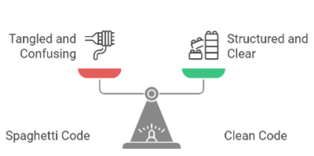
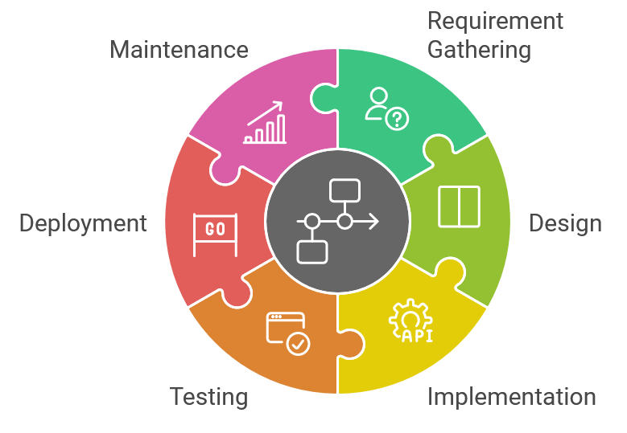

# Building Software Right: It's More Than Just Coding
**[German version](https://github.com/AlexNek/software-dev-resources/blob/master/SDLC/readme-de.md)**

## Overview

So, you're trying to **understand** software development these days, right? It’s not just about producing code anymore, but about creating things that work well, that people actually *want* to use, and that don't fail when things get difficult. The time when coding was done by one person is over. So, how do we actually get things done? Let's explore.

This article will cover the key parts of current software development, showing how the Software Development Life Cycle (SDLC) is important. We will discuss why it’s important to **identify** the problem you’re solving, adopt an agile way of working, why clean code is important, and the importance of DevOps. Finally, we will connect everything by focusing on the user, that software development is a continuous process, and how to complete everything.

If you're an **experienced developer**, you likely know most of this already. This is mainly for project managers who are **facing difficulties** with software development but aren't exactly sure where to start.

## Manager's Checklist

Use this checklist to evaluate your software development process. If you are consistently answering "no" to these questions, you probably need to improve your process:

-   **Understanding the Problem:**
    - Do we spend enough time to understand the real needs of our users, or are we focusing only on the requests?
    - Are we including users in the early stages of the process?
-   **Planning and Iteration:**
    - Do we plan the work in short cycles, allowing us to adapt to changes?
    - Are we flexible and ready to adjust our cource when new information or feedback is received?
-   **Writing Code:**
    -   Are we making sure the code is clean, well-documented, easy to read and maintainable?
    -   Are we doing code reviews on a regular basis?
    - Are we effectively using version control by committing code changes frequently and using branches for different features?
-   **Testing:**
    - Are we testing early and often to find bugs, before our users do?
    - Are we using different kinds of tests (unit, integration, user acceptance)?
    - Are we automating as much of the testing process as possible to ensure faster and more reliable results?
-   **Collaboration:**
    - Do developers, product owners, designers, and users work together as a unit, or are they separated from each other?
    - Do we have clear communication and regular meetings?
-   **Deployment and Monitoring:**
    -   Are we automating the deployment process?
    -   Are we monitoring the software and servers after deployment?
-   **Learning and Improvement:**
    - Are we reflecting on what went well and what could have been improved?
    - Are we always learning new technologies and practices to ensure that our development process is always improving?
 
A majority of "no" answers indicates a need for action. Let's look at how you can improve your processes

## Starting With the "Why"

Before we write any code, we have to know *why* we're doing it. "Because the boss said so," is not a good reason. You've got to dig a little deeper. We start working because we know people need this product. This means communicating, talking to users, and figuring out the specific issue that we're solving. If our product doesn't effectively help anyone, it will not be useful.

*   **User Interviews:** To understand the problem, talk to real users. See how they do things, understand their issues, and ask detailed questions. Listen to what they have to say and focus on their real needs.
*   **Talk to People Involved:** Discuss project goals and limits with people involved, and explore the project goals and the desired outcomes.
*   **User Stories:** Use short descriptions, known as “user stories”, to describe what a user wants. Use prototypes to test ideas and gather feedback, and make sure they are quick and interactive, to get valuable information.
*   **Data Analysis:** Use data from previous projects, market research, or surveys to identify patterns and understand user behaviors. Use this data to confirm your initial assumptions about what the users need.
*   **Use Prototypes:** Make quick prototypes to test out ideas early on, to get feedback from the users.
*   **Domain-Driven Design (DDD):** When you have complex projects, use DDD to build the software around business concepts, and create a common language for developers and experts.

## Agile: Adapting to Change

In the past, we thought we knew everything before we started. We'd spend a lot of time planning before writing any code, hoping that nothing would change. We all know how that goes. It's a **problem**. Modern software is all about being able to adapt to change, reacting to the unknown. Agile isn't some **new idea**, it's about being flexible, adapting to what's happening, and delivering value in short cycles. This means sprints, stand-ups, reviews, and a culture of always learning. We're no longer hoping that all requirements are correct from the start.

Agile methods allow us to plan in short timeframes, and be able to change direction as we need. It lets us focus on delivering value in small **pieces**. It requires us to be flexible, and not be **fixed** to the original plan, or design, or anything. Here are a few agile practices:

-   **Daily Stand-ups:** Brief daily meetings to *share progress*, discuss any issues, and *see* if anything needs attention.
-   **Sprint Planning:** Setting priorities and planning for the next sprint.
-   **Sprint Reviews:** Showing what we built to the people involved and getting feedback.
-   **Sprint Retrospectives:** Thinking about what worked well and what could be improved from the previous sprint.

## Code Quality: Keep It Clean, Keep It Testable

Now, let’s talk about the code. We've all written **poor** code, at some point. It happens. But let's avoid doing it on purpose. 

What we want to be doing is writing clean, easy-to-read, well-documented, and testable code. Here’s how I see it:

-   **SOLID Principles:** Using the SOLID principles helps to structure code in a way that makes it more readable and easier to maintain. These principles, which include **S**ingle responsibility, **O**pen/closed, **L**iskov substitution, **I**nterface segregation, and **D**ependency inversion, should help you when writing code.
-   **Clear Naming and Comments:** Using clear, descriptive names for variables and methods is the first step in documentation. Comments help explain the logic, making it easier for others to understand. This is very helpful in making the code more understandable.
-   **Consistent Code Style:** Following a code style guide, and using tools, such as Resharper (.NET) or ESLint (Javascript), are important. These tools can help you format code automatically. Using a code style guide with these tools improves your code's quality and makes it easier to read.
-   **Code Reviews:** Having other people look at your code is essential, you will learn new things and improve the product quality. AI tools can help with code reviews, but they shouldn't replace human review. The human **understanding** is still key for context, the intentions, and the interactions inside the code.
-   **Version Control (Git):** Using a system like Git is key for modern software development. Commit changes often, and use branches for new features. This helps you keep a stable code base. A well-defined branching strategy is also important, consider strategies like Gitflow or GitHub Flow. A good branching approach lets multiple people work on the same code with minimal problems.
-   **[Automated Testing](tests.md):** There is no better feeling than releasing code securely, knowing that tests help prevent problems for our users. Write different types of tests and automate as much as possible. If you want to be good at testing, try Test-Driven Development (TDD). It will influence your code, and make it better. You will see the value in the future.
-   **Technical Debt:**  Over time, development teams might take shortcuts or make compromises to deliver features faster, which might result in what is known as technical debt. Always look for technical debt, and plan time to fix the code, and keep a healthy codebase. It will **be useful** in the future.
-   **Pair Programming:** If you're dealing with complex tasks, use pair programming, with two developers working together. It is a good way to share knowledge, improve code quality, and is a good learning opportunity.

## The DevOps Approach

Having separate development and operations teams that don't work together is not efficient. We need a unified team working towards the same goal. The aim is a smooth, automated path that takes code from development into the hands of users. This means:

-   **Continuous Integration/Continuous Deployment (CI/CD):** Automate the entire software delivery process, from building, testing, and releasing. Manual deployments should be avoided.
-   **Infrastructure as Code (IaC):** Instead of manually setting up servers, you describe your infrastructure (servers, databases, networks, etc.) in code. This code can then be stored in a version control system like Git, just like your application code. This means that you can track changes to your infrastructure over time, revert to previous configurations, and easily recreate your environment as needed. Tools such as Terraform, CloudFormation, or Ansible are used to define and deploy your infrastructure as code. This enables you to create, modify, or delete servers easily and in a repeatable and predictable way.
-   **Monitoring and Logging:** Don't just release code, you need to keep track of how it's working. This includes server metrics, app logs, and other data. In modern environments, use a centralized logging system that can collect logs from different sources. This will help you keep track of your app and infrastructure performance.
-   **Alerts:** Get alerted when something goes wrong, so you can act quickly.

## The Software Development Life Cycle (SDLC) in Action

Now that we've covered the key aspects of modern development, let’s explore how it all comes together. These actions align with the various stages of the Software Development Life Cycle (SDLC) - a process that guides projects from start to delivery. We’ll look at the right way to approach these actions and where things often go wrong.

### 1. Understanding the Problem: The Real Needs *(SDLC: Requirement Gathering/Analysis)*

-   **Doing It Right:**
    -   **Analyze Requirements:** Don't accept the requirements without **analyzing them carefully**, keep asking “why” to find the main issue. Focus on the real needs and reasons of the user, and not just what they say they want.
    -   **Understand Users:** It’s critical to understand the users’ needs. You can build software that solves real problems and makes them happy by thinking like they do.
-   **Going Wrong:**
    -   **Trusting Assumptions:** Starting to code without fully understanding the issue; **trusting** assumptions; not getting users involved early; skipping research. It's like trying to solve a math problem without knowing the numbers.

### 2. Planning and Iteration: Flexibility Rules *(SDLC: Design & Planning)*

-   **Doing It Right:**
    -   **Agile is Key:** Plan in short cycles, and be ready to change plans when needed. Deliver value in small parts. Don’t fight change, be flexible, and ready to adapt. It’s like having a map, but knowing that the roads might close, so you have to adjust your route. Planning shouldn’t be inflexible; it needs to adjust to the real world.
-   **Going Wrong:**
    -   **Rigid Planning:** Spending too much time planning at the start; trying to “perfect” the design before coding; not re-evaluating the plan as the project progresses. It’s like believing you know all the answers at the start. This never works out well.

### 3. Writing Code: Quality Matters *(SDLC: Implementation)*

-   **Doing It Right:**
    -   **Write Clean Code:** The code should be easy to read, well documented, and easy to maintain.
    -   **Use Best Practices:** Follow coding standards, use version control, and do code reviews.
    -   **Future-Proof Your Code:** The code should not only work, but be easy to understand and extend by you and others. This is an investment that will reduce bugs and the cost of maintaining the software.
-   **Going Wrong:**
    -   **Messy Code:** Writing code that is difficult to read; not using version control; not documenting the code; and not having tests to prevent future problems. It's like building a house with bad materials.

### 4. Testing: Find Bugs Early *(SDLC: Testing)*

-   **Doing It Right:**
    -   **Test Early and Often:** Test often, using different tests like unit, integration, and user acceptance tests.
    -  **Automate:** Automate the testing process, to make it faster and more reliable.
    -   **Test Functionality:** Testing is about more than finding bugs; it’s about ensuring the software meets requirements, allowing you to release it securely.
-   **Going Wrong:**
    -   **Skipping Testing:** Skipping testing, and relying on users to find problems. It's like building a car without checking if it runs.

### 5. Collaboration: Teamwork Is Crucial *(SDLC: All Phases)*

-   **Doing It Right:**
    -   **Work Together:** Work together with developers, product owners, designers, and users.
    -   **Clear Communication:** Use clear communication channels and have regular meetings to share progress and get feedback.
    -   **Value Different Views:** Create an environment where everyone can share their ideas. Collaboration is essential in every phase of the SDLC.
-   **Going Wrong:**
    -   **Poor Teamwork:** Letting developers work separately; poor communication; and not listening to feedback. It leads to misunderstandings and duplicate work. When teams are not aligned, it's like a band where each member ignores the others.

### 6. Deployment & Monitoring: Code to Reality *(SDLC: Deployment & Maintenance)*

-   **Doing It Right:**
    -   **Automated Deployments:** Use automated processes to deploy code, which reduces errors.
    -   **Real-Time Monitoring:** Track your system in real-time. Try to find problems as soon as they show up.
    -   **React Quickly:** Have a plan to deal with issues, and know that you need not only to ship code, but also make sure it works well after that.
-   **Going Wrong:**
    -   **Manual Deployments:** Using manual deployments; not monitoring the product after release. This causes downtime and user frustration. It's like throwing a bottle into the ocean and never thinking about it again.

### 7. Learning & Improvement: The Ongoing Process *(SDLC: All Phases)*

-   **Doing It Right:**
    -   **Improve Always:** Look for ways to improve your work, your skills, and the product.
    -   **Be Open to Feedback:** Be open to feedback, and make changes based on that.
    -   **Reflect and Adapt:** Reflect on what went well, and what could have been better. This action should influence every phase of the SDLC.
-   **Going Wrong:**
    -  **Repeating Mistakes:** Repeating old mistakes; not adapting to new technologies; and continuing with the same old ways. It's like driving the same route every day even if there is a better option available.

## Conclusion

Software development is more than just writing code. It's about building software that is user-focused, flexible, strong, and always improving. We start working because **we know people need this product**. The key things to consider are understanding the "why," using agile methods, writing quality code, using a DevOps approach, focusing on teamwork, and always focusing on the user experience, making sure the software is functional, intuitive, and easy to use. If the UX is bad, users will find something better. Collect feedback often. Software development is a constant journey, and each mistake is an opportunity to learn. Be open to feedback, adapt to new technology, and don't be afraid to experiment.
This was just a quick overview of modern development, but it should get you thinking. Modern development is all about working together, and always thinking about the people using the software. If you remember those things, you’ll be ok. Take some time to understand the concepts we talked about. Start using these practices at work. I encourage you to keep learning and improving.