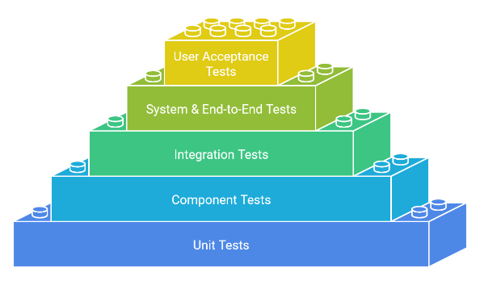

## Testen

Diese Tests werden während der Testphase des Softwareentwicklungslebenszyklus (SDLC) durchgeführt.

## Unit-Tests

- **Warum sie wichtig sind:** Unit-Tests bilden eine Grundlage, indem sie sicherstellen, dass einzelne Code-Einheiten korrekt funktionieren.
- **Fokus:** Einzelne Code-Einheiten (z. B. Funktionen, Methoden, Klassen).
- **Ziel:** Überprüfen, ob sich jede Einheit isoliert wie erwartet verhält.
- **Umfang:** Kleinste testbare Teile des Codes.
- **Beispiele:**
    - Testen, ob eine bestimmte Funktion die korrekte Ausgabe für gegebene Eingaben zurückgibt.
    - Überprüfen, ob eine Klasse ihre Eigenschaften korrekt initialisiert.
    - Überprüfen, ob die Fehlerbehandlung innerhalb einer Methode wie vorgesehen funktioniert.

## Integrationstests

- **Warum sie wichtig sind:** Integrationstests bauen auf der Grundlage auf, indem sie überprüfen, dass die Einheiten im System reibungslos zusammenarbeiten.
- **Fokus:** Interaktionen zwischen verschiedenen Teilen des Systems.
- **Ziel:** Sicherstellen, dass die Komponenten wie vorgesehen zusammenarbeiten.
- **Umfang:** Größer als Unit-Tests, mit mehreren Einheiten oder Modulen.
- **Beispiele:**
    - Testen des Datenflusses zwischen verschiedenen Modulen.
    - Überprüfen, ob eine Datenbankinteraktion innerhalb des Systems korrekt funktioniert.
    - Überprüfen der Integration einer Benutzeroberfläche mit Backend-Diensten.

## User Interface (UI)-Tests

- **Warum sie wichtig sind:** UI-Tests stellen sicher, dass die Benutzeroberfläche korrekt funktioniert und gut reagiert.
- **Fokus:** Die Elemente der Benutzeroberfläche und ihre Interaktionen.
- **Ziel:** Überprüfen, ob sich die Benutzeroberfläche wie erwartet verhält und Benutzer effektiv mit ihr interagieren können.
- **Umfang:** Bestimmte UI-Elemente oder gesamte Bildschirme.
*  **Beispiele:**
    - Testen, ob Schaltflächen, Menüs und Formulare wie erwartet funktionieren.
    - Überprüfen des UI-Layouts und der Reaktionsfähigkeit auf verschiedenen Bildschirmgrößen.
    - Testen des Navigationsflusses durch die Anwendung.

## Benutzerakzeptanztests (UAT)

- **Warum sie wichtig sind:** Benutzerakzeptanztests sind der letzte Schritt, um sicherzustellen, dass das System die Bedürfnisse und Erwartungen der Benutzer erfüllt.
- **Fokus:** Endbenutzerperspektive und Zufriedenheit.
- **Ziel:** Bestimmen, ob die Software die Bedürfnisse und Erwartungen der Benutzer erfüllt.
- **Umfang:** Das gesamte System oder bestimmte Funktionen.
- **Beispiele:**
    - Echte Benutzer testen die Software in einer realistischen Umgebung.
    - Geschäftsinteressenten überprüfen, ob die Software ihre Anforderungen erfüllt.
    - Überprüfen, ob die Benutzeroberfläche intuitiv und einfach zu bedienen ist.

## Zusammenfassung der wichtigsten Unterschiede

| Merkmal           | Unit-Tests                  | Integrationstests              | UI-Tests                      | Benutzerakzeptanztests  |
| ----------------- | --------------------------- | ------------------------------ | ----------------------------- |---------------------------- |
| **Fokus**        | Einzelne Einheiten           | Interaktionen zwischen Komponenten   | Elemente der Benutzeroberfläche | Endbenutzerperspektive      |
| **Umfang**      | Kleinste testbare Teile      | Mehrere Einheiten oder Module | UI-Elemente oder Bildschirme| Gesamtes System oder Funktionen|
| **Ziel**        | Einzelnes Verhalten überprüfen | Zusammenarbeiten sicherstellen     | UI-Verhalten und Reaktionsfähigkeit prüfen | Benutzerbedürfnisse und Erwartungen erfüllen   |
| **Durchgeführt von**| Entwickler, oft automatisiert  | Entwickler oder Tester, oft automatisiert  | Entwickler oder Tester, oft automatisiert  | Endbenutzer oder Stakeholder     |

**Im Wesentlichen:**

- Unit-Tests bilden eine Grundlage, indem sie sicherstellen, dass einzelne Code-Einheiten korrekt funktionieren.
- Integrationstests bauen darauf auf, indem sie überprüfen, dass diese Einheiten im System reibungslos zusammenarbeiten.
- UI-Tests helfen sicherzustellen, dass die Benutzeroberfläche funktionsfähig und responsiv ist.
- Benutzerakzeptanztests sind der letzte Schritt, um sicherzustellen, dass das System die Bedürfnisse und Erwartungen der Endbenutzer erfüllt.