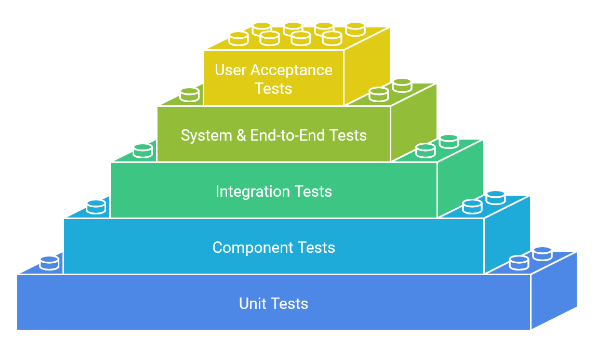

## Software testing

These tests are done during the 'Testing' phase of the Software Development Life Cycle (SDLC).

Software testing is a crucial part of the SDLC, ensuring the final product is reliable, functional, and meets user expectations. This process involves different levels of testing, methods of execution, and perspectives, all aimed at providing a thorough quality assurance process.

### Unit Tests

* **Why they are important:** Unit tests provide a foundation by ensuring individual code units work correctly.
* **Focus:** Smallest testable units like functions, methods, or classes.
* **Goal:** Verify that each unit behaves as expected in isolation.
* **Scope:** Smallest testable parts of the code.
* **Examples:**
    * Testing if a specific function returns the correct output for given inputs.
    * Checking if a class correctly initializes its properties.
    * Verifying that error handling within a method works as designed.
*   **Testing Approach**: Often done with White Box testing techniques, focusing on the code itself.
*   **Testing Method**: Usually automated.

### Component Tests

* **Why they are important:** Component tests verify a single, self-contained component of the application, ensuring it functions correctly before being integrated.
* **Focus:** A single, self-contained module or component.
* **Goal:** To verify the functionality of a specific part of the system, as it interacts with its immediate dependencies.
* **Scope:** Limited to the component and its direct dependencies.
*   **Examples:**
    *   Testing a login module, including UI inputs, password hashing, and token generation.
    *   Testing an API component responsible for data processing.
*   **Testing Approach**: Often done with White Box testing techniques, focusing on the component and its internal workings.
*   **Testing Method**: Usually automated.

### Integration Tests

*   **Why they are important:** Integration tests verify the interactions between different components or modules of the system, focusing on how they work together.
*   **Focus:** The interactions and data flow between different parts of the system (e.g., API to database, UI component to backend).
*   **Goal:** Ensure that components can communicate and work together as intended; however, it is important to note that integration testing doesn't necessarily test all the functionality of those components.
*   **Scope:** Connections and data flow between specific components or modules.
*   **Examples:**
    *   Testing data flow between different modules.
    *   Verifying that a database interaction works correctly within the system, when the code tries to perform a basic database operation.
    *   Checking the interaction between a user interface and its related backend service to make a simple change on screen.
*   **Testing Approach**: Can be approached with either White Box or Black Box techniques, depending on the level of code knowledge required. Developers with knowledge of internal workings of the tested modules may use White Box testing, whereas testers focusing on data flow can employ Black Box techniques.
*   **Testing Method**: Usually automated, but manual testing can be used in some cases.

### System Tests (End-to-End Tests)

*   **Why they are important:** System tests (also called End-to-End tests) check that the whole application works correctly. This means all the different parts of the application work together as they should. They also try to imitate how a real person would use the application.
*   **Focus:** The entire application, including all components and interactions, simulating user workflows.
*   **Goal:** To verify that the system meets functional and non-functional requirements from an end-user perspective. Also covers the entire user flows, data flows and dependencies.
*   **Scope:** The entire application or a large part of it, involving UI, APIs, databases, and external services.
*   **Examples:**
    *   Testing a complete user flow (e.g., login, add to cart, checkout, payment).
    *   Verifying that the system behaves correctly under load.
    *   Testing security configurations across the system.
    *   Testing interactions with external services (APIs, payment gateways, etc.).
*   **Testing Approach**: Primarily approached with Black Box testing techniques, focusing on the end-user experience and functional/acceptance requirements.
*   **Testing Method**: Often automated, especially using UI testing tools. May also include manual testing for complex scenarios.

### User Interface (UI) Tests

*   **Why they are important:** UI tests ensure that the user interface functions correctly and responds well.
*   **Focus:** The user interface elements and their interactions.
*   **Goal:** Verify that the UI behaves as expected and that users can interact with it effectively.
*   **Scope:** Specific UI elements, or entire screens.
*   **Examples:**
    * Testing if buttons, menus, and forms work as expected.
    * Verifying the UI layout and responsiveness across different screen sizes.
    * Testing the flow of navigation through the app.
*   **Testing Approach**: Often done with Black Box testing techniques, focusing solely on the UI as an end user would see it.
*   **Testing Method**: Usually automated, but some manual testing is also common, especially during exploratory testing.

### User Acceptance Tests (UAT)

*   **Why they are important:** User acceptance tests are the final step, ensuring that the system meets the needs and expectations of the users.
*   **Focus:** End-user perspective and satisfaction, as well as alignment with the business requirements.
* **Goal:** Determine if the software meets the needs and expectations of the users.
*   **Scope:** The entire system or specific key features from a business perspective.
* **Examples:**
    * Real users testing the software in a realistic environment.
    * Business stakeholders verifying that the software meets their requirements.
    * Checking if the user interface is intuitive and easy to use.
*   **Testing Approach**: Approached with Black Box testing techniques, where the user acts as an end-user, and not a software technician.
*   **Testing Method**: Primarily manual testing by real users, but can also include automated test flows for business case validation.

## Functional Testing

*   **What it is:** Functional testing verifies that each function or feature of the software works according to its specifications. It focuses on the user interface and what the user does to perform an action. It's a type of testing applicable across different levels, approaches, and methods.
*   **Why it's important:** Functional testing ensures that the system behaves as expected from a user's perspective, ensuring all specified features are working correctly.
*   **Focus:** User interactions, and testing the outputs of defined features and functions, with respect to specified inputs.
- **Goal:** Ensure that the system’s functionality aligns with user expectations.
- **Scope:** Applicable across different levels, from individual units to the entire system.
*   **Examples:**
    *   Verifying that the "Add to Cart" button in an e-commerce site correctly adds items to the user's cart.
    *   Verifying that a login screen validates user credentials to allow access to the system.
    *   Verifying that a filter on a dashboard only shows the relevant data.

## Additional Testing Types

*   **Soak Test:**
    *   **What it is:** A soak test (also sometimes called endurance test) tests the stability of the system over a prolonged period.
    *   **Why it's important:** It ensures there are no memory leaks or other issues that occur over time.
    *   **How it fits:** It can be applied to system or component tests.
*   **Approval Test:**
    *   **What it is:** Tests that check if the output of a function or component matches the previously "approved" output (a baseline).
    *   **Why it's important:** It helps identify when changes cause unintended output modifications.
    *  **How it fits:** Can be used at the unit or component testing level.
*    **Performance Test:**
      *   **What it is:** Performance tests evaluate how the software performs under load or stress.
      *   **Why it's important:** It ensures that the application is fast, scalable and can handle realistic user loads.
      *  **How it fits:** Often applies to system or end-to-end tests.
*   **Exploratory Test:**
    *   **What it is:** A testing method where testers explore the software freely to find bugs, without predefined test cases.
    *   **Why it's important:** It helps uncover unexpected issues and provides creative input.
    *    **How it fits:** Often applied to UI, system tests, and during user acceptance.
*   **Regression Test:**
    *   **What it is:** Tests that re-run existing test cases to ensure that new changes or bug fixes haven't introduced new problems (or "regressions") in existing functionality.
    *   **Why it's important:** Prevents previously working parts from breaking when changes are made.
    *   **How it fits:** Can be performed at any testing level (unit, integration, system), often automated.
*   **Smoke Test:**
    *   **What it is:** A quick set of basic tests to check the basic functionality of the software, performed after a code change to confirm the most critical parts are working.
    *   **Why it's important:** Ensures that the system is stable before more rigorous testing begins.
    *  **How it fits:** Often performed as a quick check of system tests after a deployment.
*   **Sanity Test:**
    *   **What it is:** Similar to a smoke test, it focuses on critical functionality, but it tests specific areas that have changed.
    *   **Why it's important:** A quick check to ensure the changed parts are stable.
    *   **How it fits:** Often done as part of system tests, or after a bug fix is deployed.
*   **Load Test:**
    *   **What it is:** Load testing checks how the system performs when it is used by many users simultaneously.
    *   **Why it's important:** It identifies performance and scalability issues under stress conditions.
     *  **How it fits:** Usually applied at the system level.

## Key Differences Summarized

| Feature                       | Unit Tests                | Component Tests            | Integration Tests                | System Tests (End-to-End) | UI Tests                    | User Acceptance Tests       |
|-------------------------------|---------------------------|---------------------------|----------------------------------|---------------------------|----------------------------|----------------------------|
| **Focus**                     | Individual units          | Individual components     | Interactions between components | Entire application         | User interface elements    | End-user perspective       |
| **Scope**                     | Smallest code units       | Single component & dependencies | Specific integrations           | Entire system or features| UI elements or screens      | Entire system or business critical features|
| **Goal**                      | Individual unit behavior  | Individual component function| Ensure components work together | Verify entire system from a users perspective | Verify UI behavior and responsiveness  | Meet user needs and expectations and business case    |
| **Performed by**               | Developers, automated     | Developers, often automated   | Developers/Testers, often automated| Testers, automated         | Developers/Testers, often automated | End-users or stakeholders    |
| **Testing Approach**          | White Box                 | White Box                 | White/Black Box                | Black Box                  | Black Box                   | Black Box                   |
| **Testing Method**             | Automated                | Automated                 | Usually Automated                | Primarily Automated (with some Manual) |  Usually Automated (with some Manual)    | Primarily Manual (sometimes automated)     |

**Testing Methods and Approaches:**

*   **Manual Testing:** Tests executed by humans, ideal for usability, complex scenarios, and exploratory testing.
*   **Automated Testing:** Tests executed by scripts/tools, efficient for regression and repeatable tests.
*   **White Box Testing:** Testing based on internal code and logic, used for unit, component, and some integration tests.
*   **Black Box Testing:** Testing based on inputs/outputs, used for system, UI, and acceptance tests, and some integration tests.

**In essence:**

*   **Unit and Component Tests** ensure the correctness of individual code and components, providing a foundation for testing.
*   **Integration Tests** verify interactions between parts of the system, focusing on data flow, API contracts, and component inter-dependencies.
*   **System (End-to-End) tests** provide a broad view, ensuring that the system functions correctly as a whole from an end user perspective, simulating user workflows.
*   **UI Tests** focus specifically on the user interface, ensuring its responsiveness and proper behavior.
*   **User Acceptance Tests** provide the final validation by end users and business stakeholders.
*   **Functional testing** ensures that all the features work from the point of view of the user.
*   **Additional Test Types** fill specific needs during different parts of development and at different testing levels.

By implementing these various testing types and methods, and understanding their roles within the SDLC, you can create a more robust, reliable, and user-friendly software product.
